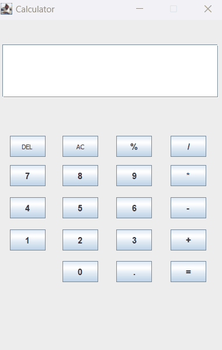

# 🧮 Calculator (Java)

 

  

## 📝 Description
This is a desktop project developed in Java Swing, capable to execute default math operations

## 🎬 Demonstration

## 🛠️ Tech used
* **Language:** Java 17+
* **GUI:** Java Swing & AWT
* **Build Tool:** Maven 

## 🚀 How to start
1. Clone the repository
2. Open it in you IDE
3. Run 'CalculatorUI.java'
